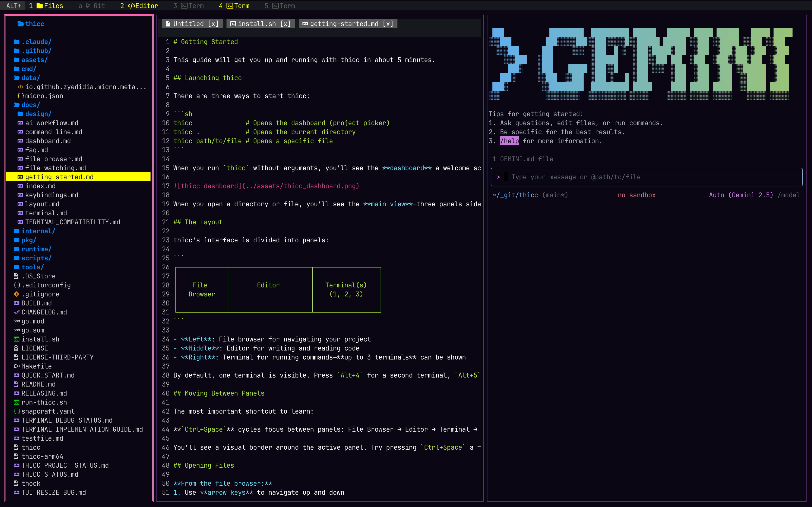

<p align="center">
  
</p>

**thicc** — a fork of [micro](https://micro-editor.github.io) that's heavy on opinions, not bloat.

## What is thicc?

File browser. Editor. Terminal. AI tools. One vibe.

thicc is for developers who pair with AI but still read the diff. We made the decisions so you don't have to—no config rabbit holes, no theme paralysis. Just open it and go.

<p align="center">
  
  &nbsp;&nbsp;&nbsp;&nbsp;
  
</p>

## Why thicc?

Most editors let you configure everything. We don't. thicc ships with one colorscheme, one layout, and zero apologies. Less time tweaking, more time shipping.

We're built for the AI-assisted workflow—terminal pane ready for Claude, Copilot CLI, or whatever you're into. But we put *you* in the driver's seat, not the model.

## Get it

```sh
curl -fsSL https://raw.githubusercontent.com/elleryfamilia/thicc/main/install.sh | sh
```

Or build from source:

```sh
git clone https://github.com/elleryfamilia/thicc
cd thicc
make build
sudo mv thicc /usr/local/bin
```

## Run it

```sh
thicc              # Opens the dashboard
thicc .            # Opens current directory
thicc path/to/file # Opens a specific file
```

**Navigate between panes:** `Ctrl+Space`

## You'll need

- A Nerd Font (for the icons)
- A terminal with true color support (iTerm2, Kitty, Alacritty)

### Nerd Font setup

**macOS:**
```sh
brew install --cask font-jetbrains-mono-nerd-font
```
Then set "JetBrainsMono Nerd Font" as your terminal font.

**Linux:**
```sh
mkdir -p ~/.local/share/fonts
cd ~/.local/share/fonts
curl -fLO https://github.com/ryanoasis/nerd-fonts/releases/latest/download/JetBrainsMono.zip
unzip JetBrainsMono.zip && fc-cache -fv
```

## Nightly Builds

> **Warning:** Nightly builds are automatically generated from the latest code. They may contain bugs, incomplete features, or breaking changes. Use at your own risk.

```sh
curl -fsSL https://raw.githubusercontent.com/elleryfamilia/thicc/main/install.sh | CHANNEL=nightly sh
```

To receive nightly auto-updates after installing, run `set updatechannel nightly` inside thicc.

To switch back to stable, re-run the standard install script above.

## Updating

thicc checks for updates automatically. To manually check and install updates:

```sh
thicc --update
```

## Uninstalling

```sh
curl -fsSL https://raw.githubusercontent.com/elleryfamilia/thicc/main/uninstall.sh | sh
```

## License

MIT
