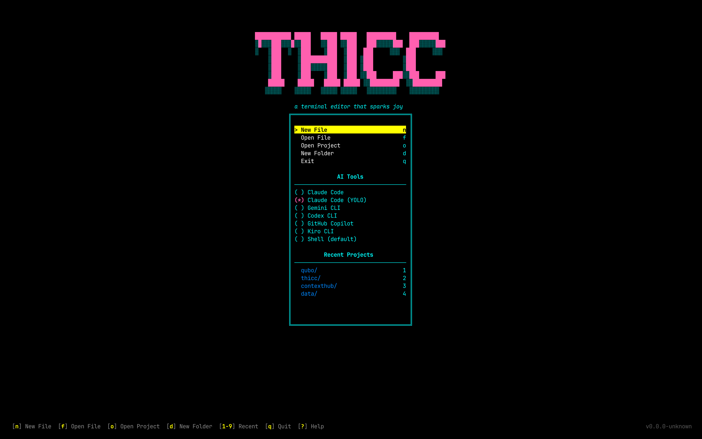

# Dashboard

When you launch thicc without arguments, you see the dashboard—a welcome screen that helps you start working quickly.



## Overview

The dashboard provides quick access to:

- **Create new files and folders**
- **Open existing projects**
- **Access recent projects**
- **See AI tools status**

## Menu Options

### New File

Creates a new, empty file. You'll be prompted to enter a filename.

### Open Project

Opens a directory browser where you can navigate to and select a project folder. Once selected, thicc opens with that directory in the file browser.

### Open File

Opens a file browser where you can navigate to and select a specific file to edit.

### New Folder

Creates a new folder. You'll be prompted to choose a location and enter a folder name.

### Exit

Closes thicc.

## Recent Projects

Below the menu, you'll see a list of recently opened projects (up to 10). This makes it easy to jump back into what you were working on.

Recent projects are stored in `~/.config/thicc/recent.json` and persist between sessions.

### Quick Access

Press **`1-9`** to instantly open a recent project by number (1 = most recent).

### Managing Recent Projects

- **`Delete`** or **`Backspace`**: Remove the selected project from the list
- Non-existent paths are automatically cleaned up when the dashboard loads

## AI Tools Section

The dashboard shows which AI tools are installed on your system:

- **Installed tools** show a checkmark (✓)
- **Not installed tools** show install instructions

This gives you a quick overview of what's available for use in the terminal pane. You can toggle tool selection with `Enter` when focused on the AI tools pane.

<!-- TODO: screenshot of AI tools section -->

## Keyboard Shortcuts

### Navigation

| Shortcut | Action |
|----------|--------|
| `↑` / `↓` or `j` / `k` | Navigate menu items |
| `←` / `→` or `h` / `l` | Switch between menu and recent projects |
| `Tab` | Cycle between panes |
| `Enter` | Select item / open project |
| `Escape` or `q` | Exit thicc |

### Quick Actions

| Shortcut | Action |
|----------|--------|
| `n` | New file |
| `f` | Open file picker |
| `o` | Open project picker |
| `d` | New folder |
| `?` | Show onboarding guide |
| `1-9` | Open recent project by number |
| `Delete` / `Backspace` | Remove selected recent project |

## Project Picker

When you select "Open Project" (or click the project path header in the file browser), you'll see the project picker:

<!-- TODO: screenshot of project picker -->

The project picker lets you:
- Browse directories
- Navigate with arrow keys
- Press Enter to open or expand directories
- Press Escape to cancel

## File Picker

Similar to the project picker, but for selecting individual files to open.

## Folder Creator

When creating a new folder, you'll see a modal that lets you:
1. Choose the parent location
2. Enter the folder name

## First-Time Experience

New users see an **onboarding guide**—a multi-page tutorial that walks through thicc's key features:

1. **Toggle Panes** — `Alt+1` through `Alt+5` to show/hide panels
2. **Switch Projects** — Click the project name header to change directories
3. **Terminal & AI** — Choose your tool from the terminal selector
4. **File Management** — Create, rename, and delete files

Navigate the guide with `→` / `←` (or `Enter` / `Backspace`). Press `Escape` to close.

You can revisit the onboarding guide anytime by pressing `?` on the dashboard.

<!-- TODO: screenshot of onboarding guide -->

## Bypassing the Dashboard

If you prefer to skip the dashboard:

```sh
thicc .               # Open current directory
thicc ~/my-project    # Open a specific directory
thicc path/to/file    # Open a specific file
```

These commands skip the dashboard and go directly to the main view.

## Tips

1. **Recent projects** are the fastest way to resume work
2. **Number keys** let you quickly select menu items without navigating
3. The dashboard is **not the main view**—it's just a launcher. Most of your time will be spent in the 3-panel layout.

---

Next: [FAQ](faq.md) — Common questions and troubleshooting
